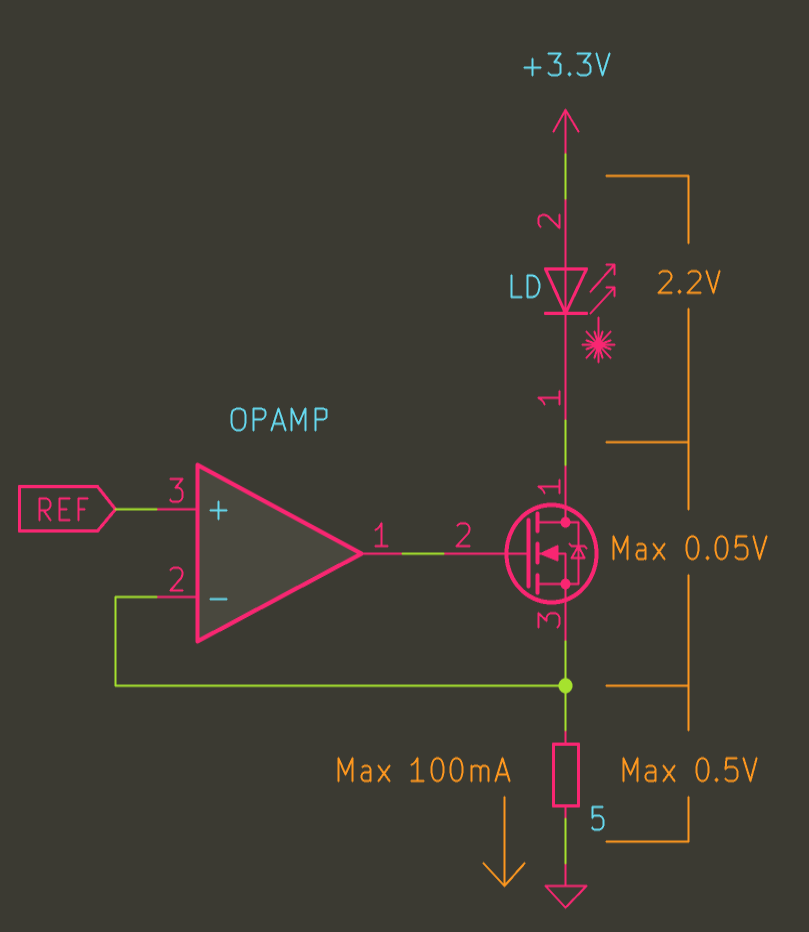

# 回路設計

## 車両回路設計

### 回路ブロック設計

回路ブロック図を以下に示す。

### 電源系統の設計

電源系統図を以下に示す。

#### LiPo バッテリの選定

[システム設計](system.md)の[駆動系のスペック設定]より、最大加速時の駆動モータ消費電力は $15V \times 0.9 \times 0.75 \fallingdotseq 10[W]$、吸着機構が同程度と見積もると、
$15[W]$ 必要となり、DCDC や駆動回路の損失を考えると、電源容量としては $18[W]$ 以上は確保したい。

Robin で販売されている HongJie30C 放電 バッテリを採用すると、
1S あたりおよそ $30C \times 0.1Ah \times 3.7V \fallingdotseq 10W$ 出力可能。
2S 構成にすることで 20W 程度供給可能となり、成立する。この方向性で進める。

#### 3.3V 系の選定

TI のフェライトビーズ保障付きパワーモジュール(TPSM82912)を使用する。
公称値として出力ノイズ 20uV 未満、出力リップル 10uV 未満なので、
後段に LDO を追加せずに本 IC から直接供給する。

#### SEPIC コンバータの選定

TI の USB PD 向け SEPIC コンバータを使用する。

### モータドライバの選定

#### モータの電気的定数

| 項目           | 値           |
| -------------- | ------------ |
| 抵抗           | 9.7 $\Omega$ |
| インダクタンス | 40usH          |

電気的時定数 $\tau = \frac{40u}{9.7} = 4.1us$
$\frac{1}{\tau} = \frac{1}{4.1u} = 244kHz$

#### 電流の流し方検討

モータ電流を連続・不連続のどちらにするかを設定する。

電気的時定数が約 250kHz なので、連続(と見なせる)電流を流す為には、
250kHz の 4-5 倍、1MHz 以上のスイッチング周波数で駆動する必要があり、そのようなモータドライバは殆ど存在しない。

電流不連続モードで特に問題になるのは、探索時のモータ発熱だが、
今回は、モータ電源に SEPIC コンバータを採用する為、探索時は低い電圧で駆動する事ができ、問題にならない。
今回は電流不連続とする。

#### モータドライバ選定

以下のスペックを満たすように選定する

| 項目       | スペック                                                   |
| ---------- | ---------------------------------------------------------- |
| モータ電圧 | 3V ~ 20V で動作可能                                        |
| 電流       | 連続 1A 瞬間 2A まで出力できること                         |
| 周波数     | 100kHz 以上 (デッドタイム 1% (100kHz であれば 100ns) 以下) |

以上のスペックを満たすモータドライバ IC として
MPS 社製 [MP6550](https://www.monolithicpower.com/jp/mp6550.html) を選定する。

### 光センサ回路の選定

#### TIA の設計

##### アンプの選定

AnalogDevices 社が公開している[フォトダイオード回路設計ウィザード](https://tools.analog.com/jp/photodiode/)を使って選定する。

> この方法だと AnalogDevices の OPAMP に限定されてしまうが、OPAMP は普通に選定を進めてもたいてい AnalogDevices の IC に落ち着くのでこれを使ってみる。
> (マイクロマウス大会にスポンサーしていただいている事もあるし・・・)

■ 1 フォトダイオードのパラメータを設定

フォトダイオードには[VEMD2020X01](https://www.mouser.jp/ProductDetail/Vishay-Semiconductors/VEMD2020X01?qs=sGAEpiMZZMtsIJyd5Yl6B85WcSK325amjCxQTsTd2lY%3D)を使用する。

下記のように設定した。

これらの値は、データシートの下記部分から算出した。

- ピーク入力光強度は 1[mW/cm^2^]に設定
- 逆電圧は、きりの良い値として 1[V]を設定(根拠なし)
- 静電容量は逆電圧 1[V]のときの値をデータシート Fig.4 から拾ってきた値に設定
- シャント抵抗は Fig.1 から 25 度のとき暗電流=1[nA],V~R~=10[V]なので、R~SH~=10[V]/1[nA]=10[GΩ]
- ピーク電流は 1[mW/cm^2^]のときの値を採用し、少し余裕を見て 12[uA とした]

■ 2 OPAMP の選定

- ピーク電圧は 2[V]とした
  - 単電源回路なので、逆電圧 1[V]は入力コモン電圧となる。それに対し、電源電圧が 3.3[V]であるため、残り 2.3[V]の中から適当な値を選択した。
- 速度はパルス幅を 5[uS]とした
  - MCU の A/D 変換器が受け付けられ(A/D の最小周期は 0.2[uS])、多少余裕がある中で狭めのパルス幅。
  - 狭めのパルス幅とするのは
    - 発光の消費電力を下げるため
    - 積分により分解能を向上させるため
- ピークスライダーはパルス応答画面を見ながら適当に調整した
- オペアンプを AD8605 に選定
  - パッケージサイズでソートして選定した

#### LD 定電流駆動回路の設計

##### LD 定電流駆動回路の素子選定

IR LD として[PLPVYL1 940A_E](https://www.mouser.jp/ProductDetail/ams-OSRAM/PLPVYL1-940A_E?qs=DPoM0jnrROW5mJUCqekk6Q%3D%3D&srsltid=AfmBOopRuynBYZWkpI2Sc1e8eOFky_fNlxR7WRwVcmOTwRrqGT7j6zpZ)を使用する。
OPAMP は TIA と同一素子(AD8605)を使用する。
FET は[SSM3K56FS,LF](https://www.mouser.jp/ProductDetail/Toshiba/SSM3K56FSLF?qs=PiFplXvYe5XjAd54EjZm0w%3D%3D&srsltid=AfmBOopUdENztxvxZxZvqZsFe9lLrOsD-TfPg9g0fZn4EONaAyRSmaWm)を使用する。

##### LD 定電流駆動回路の定数計算

電源電圧 3.3V / 最大電流 100mA で成立するように電流検出抵抗の値と FET を選定する。

電流検出抵抗= $5\Omega$
FET に[SSM3K56FS](https://www.mouser.jp/ProductDetail/Toshiba/SSM3K56FSLF?qs=PiFplXvYe5XjAd54EjZm0w%3D%3D&srsltid=AfmBOoooyhhwk9dJ2MpbOYbiml_IvUHeTwtiIo24qhA4ECEBOKI_WzPS)を利用する。

### MCU 関連検討

#### ペリフェラル検討

MCU に接続する機能一覧と対応するペリフェラルを列挙する。

| ペリフェラル | 用途                           |
| ------------ | ------------------------------ |
| TIM1         | センサ切り替えタイミング生成   |
| TIM2         | 1uSx32bit グローバル時間タイマ |
| TIM3         | エンコーダ右                   |
| TIM4         | 発光タイミング生成ワンショット |
| TIM5         | エンコーダ左                   |
| TIM6         |                                |
| TIM7         |                                |
| TIM8         | 走行モータ PWM                 |
| TIM9         |                                |
| TIM12        | ADC トリガ                     |

##### センサ駆動検討

タイマを 3ch 使用し、1ch でチャンネルの切り替え、それに同期スタートするワンショットタイマで LED の発光タイミング制御を行い、
もう 1ch で A/D をトリガする。

#### ピン配置検討

| 回路機能          | ペリフェラル | Pin                                                      |
| ----------------- | ------------ | -------------------------------------------------------- |
| RESET             | RESET        | NRST                                                     |
| BOOT SELECT       | BOOT         | BOOT0                                                    |
| SWD               | SWD          | PA13(SWDIO) PA14(SWDCLK)                                 |
| UART              | UART5        | PB12(UART5_RX) PB13(UART5_TX)                            |
| IMU               | SPI2 /EXTI8  | PB14(SPI2_MISO) PB15(SPI2_MOSI) PA9(SPI2_SCK) PA8(EXTI8) |
| 定電流ドライバ    | DAC1 / GPIO  | PA4(DAC1) PB8(TIM4_CH3)                                  |
| 光センサ TIA      | ADC1         | PC0 (ADC1_INP10)                                         |
| モータ電流 ファン | ADC1         | PC1 (ADC1_INP11)                                         |
| モータ電流 右     | ADC1         | PC2 (ADC1_INP12)                                         |
| モータ電流 左     | ADC1         | PC3 (ADC1_INP13)                                         |
| エンコーダ右      | TIM3         | PB4(TIM3_CH1) PB5(TIM3_CH2)                              |
| エンコーダ左      | TIM5         | TIM5_CH1 TIM5_CH2                                        |
| EEPROM            | SPI4         |                                                          |
| PSRAM             | OCTO-SPI     |                                                          |
| LiPo              | ADC2         | ADC2_INP12 ADC2_INP13                                    |
| SEPIC DCDC        | ADC2 I2C3    | ADC2_INP10 I2C2_SDA I2C2_SCL                             |
| 吸引モータ        |              |                                                          |
| 走行モータ        | TIM8         | PC6(TIM8_CH1) PC7(TIM8_CH2) PC8(TIM8_CH3) PC9(TIM8_CH4)  |
| トラッキング LED  | GPIO         |                                                          |
| 表示 LED(RGB)     | GPIO         |                                                          |
| 表示 LED(Red)     | GPIO         |                                                          |

