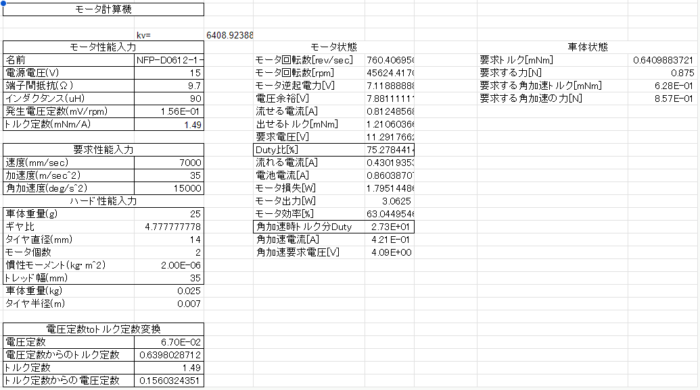

# システム設計

システムとしての方向性とそれを満たすシステムの構成について検討・設計内容を記録する。

## コンセプト

### メインコンセプト

**自由曲線で**高速に走行する

### チャレンジしたいこと

- スカートなし吸引
- 昇降圧レギュレータによる走行電力管理
- 光センサを利用した PC との光 UART 通信
- 自己発光式ストロボスコープによる調整

## 要求

### 走行性能

2023 年度大会の上位陣のパラメータを参考に、走行性能の目標性能を以下のように設定する。

| 項目             | 値             |
| ---------------- | -------------- |
| 加速度           | 35[m/s^2]      |
| 最高速度         | 7[m/s]         |
| ターン向心加速度 | 60[m/s^2]      |
| 角加速度         | 15000[rad/s^2] |

### 機能

コンセプトを実現するための機能の一覧を以下に示す。

- マイクロマウス競技機能
  - NTF が定めるマイクロマウス競技に則った走行を行う
  - 探索走行
    - 最速経路を短い時間で探索する事を目的として走行する
  - 最短走行
    - 最速経路を走行する
- 調整機能
  - 車両のパラメータを調整するための動作を再生する
- パラメータ機能
  - パラメータを保持する
  - パラメータを GUI ソフトウェアから変更する
- ログ機能
  - 走行ログ機能
    - 走行時のタイムスタンプ・生センサ値・車両の状態空間を毎制御周期記録する
  - イベントログ機能
    - 特定のイベントが発生した事を 1uS 分解能のタイムスタンプとイベント種別で記録する
  - 天井カメラログ
    - 車両 LED のストロボ発光と天井カメラの長時間露光により位置・角度を算出する
  - ログ解析機能
    - 走行ログ・イベントログを MCU から GUI ソフトウェアに転送する
    - 走行ログと天井カメラログを組み合わせて解析を行う
- 制御機能
  - 目標軌道生成機能
    - 自由曲線で目標軌道を生成する
  - 自己位置推定機能
    - 自己位置を推定する
- デバッグ機能
  - 気持ち良いプログラムデバッグ環境を提供する
- フェイルセーフ機能
  - バッテリ電圧の下限によって機能を停止する
  - 走行失敗時に車両へのダメージを最低化させつつ停止する

## システム構成

### 開発システムの構成

気持ち良いデバッグ環境を提供するための開発システム構成を以下に示す。

図中の各要素を以下に示す。

■ ハードウェア

| 項目                     | 説明                                                                                                                                           |
| ------------------------ | ---------------------------------------------------------------------------------------------------------------------------------------------- |
| PC                       | Ubuntu 24.04(予)をインストールしたノート PC(現在は 23.10)                                                                                      |
| Raspberry Pi + GS Camera | Rapberry Pi 4B 8GB + RPi Global Shutter Camera                                                                                                 |
| 充電器                   | さくらねずみ玄 2 のバッテリを充電する充電器。 1S LiPo セルを 4 個同時に充電可能とする                                                      |
| 開発 I/F                 | CMSIS-DAP+VCOM または DAP-Link 相当の機能を持つデバッグアダプタ。[hs-probe](https://github.com/probe-rs/hs-probe) をベースにしたものを使用する |
| さくらねずみ玄 2         | 開発対象のマイクロマウスの機体。                                                                                                               |

■ 機能

| 項目               | 説明                                                                                   |
| ------------------ | -------------------------------------------------------------------------------------- |
| Sakuranezumi ExCam | 天井カメラをキャプチャし、LED ストロボ発光輝点のリストを抽出するソフトウェア。         |
| vscode             | 開発環境。                                                                             |
| Sakuranezumi App   | GUI ソフトウェア。パラメータ書き込み、ログの解析を行う。                               |
| probe-rs           | デバッガ。Debug Adapter Protocol を実装しているため vscode から MCU のデバッグが可能。 |
| VirtualCOM         | 車体との UART 通信を USB と接続する。                                                  |
| CMSIS-DAP v2       | ARM マイコン向けデバッグアダプタ。                                                     |

### 車両の構成

車両の主要な構成要素を以下に示す。

| 項目             | 説明                                                   |
| ---------------- | ------------------------------------------------------ |
| バッテリ         | 車両の電源となるバッテリ                               |
| MCU              | 車両を制御するマイクロコントローラ                     |
| IMU              | 車両の加速度・角速度を測定するセンサ                   |
| エンコーダ       | ホイールの回転量を測定するセンサ                       |
| 光センサ         | 車両の姿勢を測定するセンサ                             |
| 不揮発メモリ     | パラメータやログを記録するメモリ                       |
| 外部 RAM         | 低速・大容量のデータを扱うためのメモリ                 |
| 昇降圧コンバータ | 駆動モータ・吸引モータに電力を供給する DCDC コンバータ |
| 駆動モータ       | 車両を動かすモータ                                     |
| 吸引モータ       | 車両の垂直抗力を増加させるモータ                       |
| ストロボ LED     | 車両の軌跡を外部カメラから認識するための LED           |
| 表示 LED         | モード選択状態を表示する LED                           |

### ソフトウェアの構成

ソフトウェアの構成図を以下に示す。

## 要素の設計

### 足回りの設計

#### ２輪か４輪か

駆動輪を 2 輪・4️ 輪どちらにするか選択する。

- どちらでも要求仕様を満たす事は可能と思われる
- マイクロマウス 2023 ではマイクロマウス・クラシック共に 2 輪だった
- ターン速度を上げるためには角加速度を上げる必要があり、２輪の方が有利な可能性が高い
  - 4 輪は前後に伸ばした車体ででピッチを抑える機構が不要な事から、車両全長を抑えられる(=慣性モーメントを小さくできる=角加速度を上げられる)可能性があるが、センサ配置等を考慮すると難しいため、今回は除外する。

-> **2 輪**に決定

#### 駆動系のスペック設定

下記のスペックを満たす駆動系を設計する。

| 項目             | 値             |
| ---------------- | -------------- |
| 加速度           | 35[m/s^2]      |
| 最高速度         | 7[m/s]         |
| ターン向心加速度 | 60[m/s^2]      |
| 角加速度         | 15000[rad/s^2] |

設計パラメータは以下の通り

| 項目                                | 設計結果                           | 設計根拠                                                                                                                                                                      |
| ----------------------------------- | ---------------------------------- | ----------------------------------------------------------------------------------------------------------------------------------------------------------------------------- |
| 車両重量                            | 25[g]                              | (逆説的だが)CAD で試行錯誤した設計データから                                                                                                                                  |
| 重心 Yaw 軸まわり車両慣性モーメント | 2^10-6[kg・m・^2]                  | 同上                                                                                                                                                                          |
| 電源                                | LiPo2S + SEPIC DCDC 2-20[V] (可変) | モータとあわせて効率の良い駆動のために都度設定する。                                                                                                                          |
| 車両長さ                            | 65[mm]                             | 2 輪マウスなので加速時のピッチ方向モーメントを抑える必要があり、なるべく長くとりたい。余裕を持った中で、マス目の内側長さ 84mm に収まる                                        |
| 車両幅                              | 38[mm]                             | 一般的な車幅として設定。(自由曲線で走行するメリットを増やすために)狭くしたい思いもあったが、角加速度を出しにくくなる可能性が高いため見送り。                                  |
| タイヤ直径                          | 14[mm]                             | タイヤに少しテンションをかけ、タイヤの応答を上げる事を目的として大きめに設定。値は適当。                                                                                      |
| モータ                              | NFP-D0614-2-3.0                    | なるべく低い電池電流で駆動可能となるように、低速回転タイプのモータを選定した。(本モータの端子間抵抗は 9.7[Ω]、トルク定数は 1.49[mNm/A]、発生電圧定数は 0.156[mV/rpm]である。) |
| ギヤ比                              | 43:9                               | ギヤ比は高めにしたい。モジュールを経験則から 0.3 として、タイヤ直径に沿うギヤ歯数と、入手しやすいピニオン歯数から。                                                           |

上記パラメータで設計した結果を以下に示す。

### 吸引機構

ファンのような物を車両底面で回転させるとなぜか吸引力が発生する機構を利用する。
原理が不明のため、３Dプリンタで様々な形状を試す事で効率のよい吸引を実現する。

### 光センサの設計

#### エミッタ・レシーバについての検討

さくらねずみ玄1では発光1:受光2の構成により、距離と角度の成分を分離する事を考えたが、
うまく行かなかった為、通常の構成に戻す。

その代わりにセンサの使い方を変え、エンコーダおよびIMUによるオドメトリと光センサ値を過去一定期間記録し、照合する事で自由度を上げ、距離と角度をそれぞれ測定する事を考える。

また、レシーバにはフォトダイオードを使用する。
これは、エミッタのON時間を減らすことにより消費電力を下げる事が主目的である。

#### 配置の検討

さくらねずみ玄1では前センサを中央に１つの配置にしていたが、斜め走行中に位置推定を行う事が難しい為、一般的に使われる構成に変更する。
